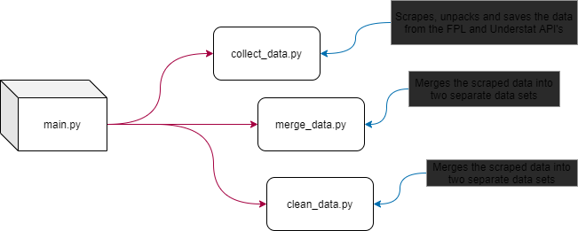

# FPL-Ensembling

## Project Description

This repository is used for a mini-dissertation project, which is completed in partial fulfilment for the degree of Master of Industrial Engineering under the supervision of Dr. Thorsten Schmidt-Dumont. The aim of this mini-dissertation is to investigate the validity of using machine learning and optimisation techniques to suggest player transfers for a manager in the Fantasy Premier League.

## Project Goals

* Forecast FPL player weekly points with an ensemble of machine learnign algorithms
* Construct a team by using an optimisation technique
* (Maybe) Investigate hindsight optimisation

## Project Flow

## Credits
Historical season data: https://github.com/vaastav/Fantasy-Premier-League

